# Research Methodology

> **Status:** Minimum Methodology-Engineering Contract v0.1

## Purpose

This repository develops a general methodology for conducting reproducible research.

Its central determination is:

> **A methodology is a normative object transformation system.**

It defines which research objects exist, how they may be transformed, what evidence and rules each transformation requires, how outputs are verified, and how provenance, uncertainty, and failure are preserved.

It does not conduct research itself.

## Governing Question

> **How should research objects be transformed into progressively stronger, reviewable, and reproducible research artifacts?**


## The Continuous Research System

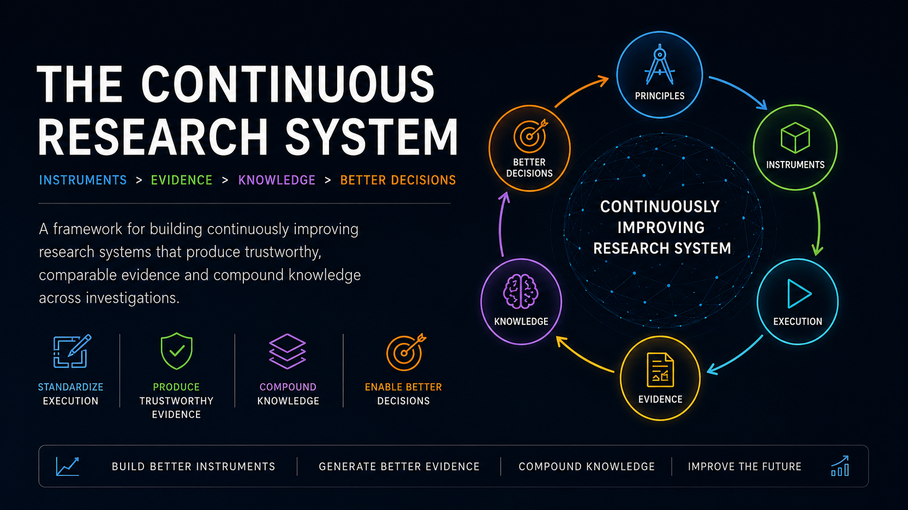

Research Methodology defines reusable contracts and research instruments that transform methodological principles into repeatable execution, comparable evidence, and cumulative knowledge.

### 1. The Problem

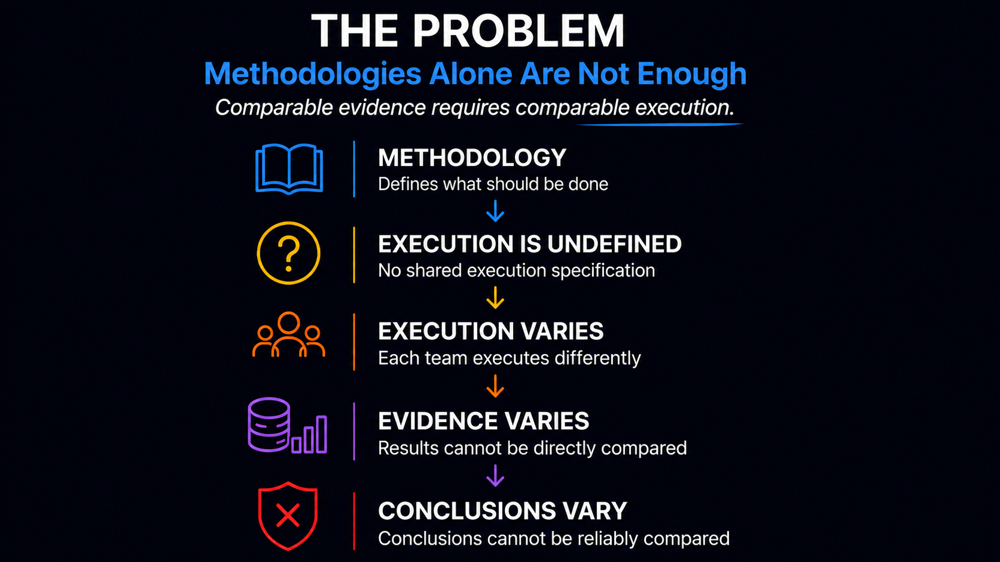

Methodology may define principles without fully specifying execution. When execution varies, evidence and conclusions become difficult to compare.

### 2. The Shift

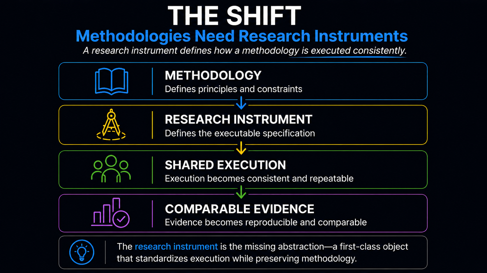

A research instrument is the missing abstraction between methodology and execution. It preserves the methodology while defining a shared execution specification.

### 3. The Research Instrument Object Model

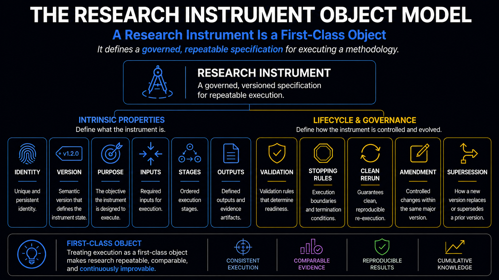

A research instrument is a governed, versioned, first-class methodology object with explicit identity, purpose, inputs, stages, outputs, validation, amendment, supersession, and stopping rules.

### 4. The Research Instrument Lifecycle

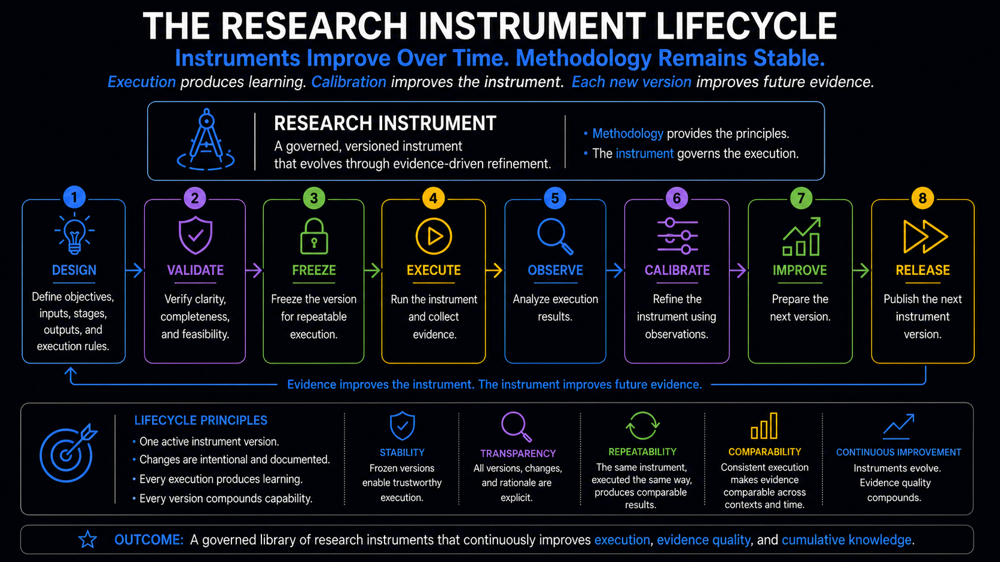

Instrument versions move through design, validation, freeze, execution, observation, calibration, improvement, and release. Methodological principles remain stable while instruments evolve through evidence-driven refinement.

### 5. Research Instrument Execution

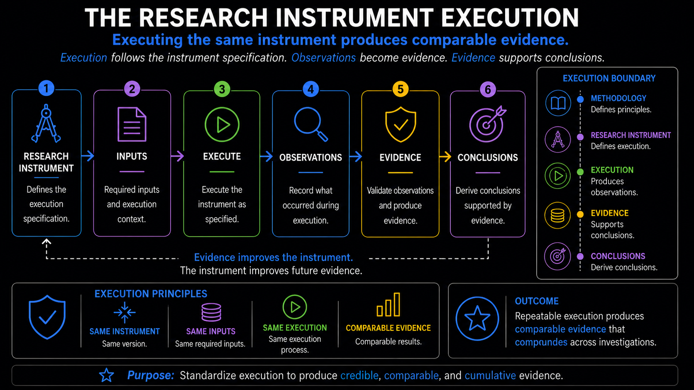

Execution applies a frozen instrument specification to declared inputs, producing observations that may later become evidence. Execution does not establish scientific truth, authority, or execution permission.

### 6. The Research Evidence Object Model

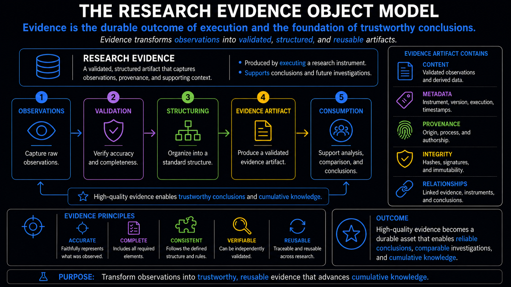

Evidence is a durable, structured artifact with explicit content, metadata, provenance, integrity, relationships, uncertainty, and limitations.

### 7. From Evidence to Knowledge

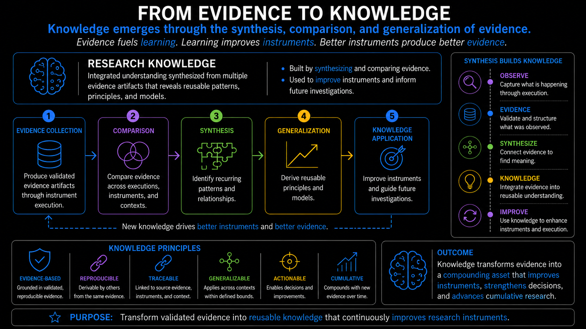

Knowledge emerges through comparison, synthesis, and bounded generalization across multiple evidence artifacts. Evidence does not automatically become knowledge or authorize conclusions.

### 8. The Research Methodology Architecture

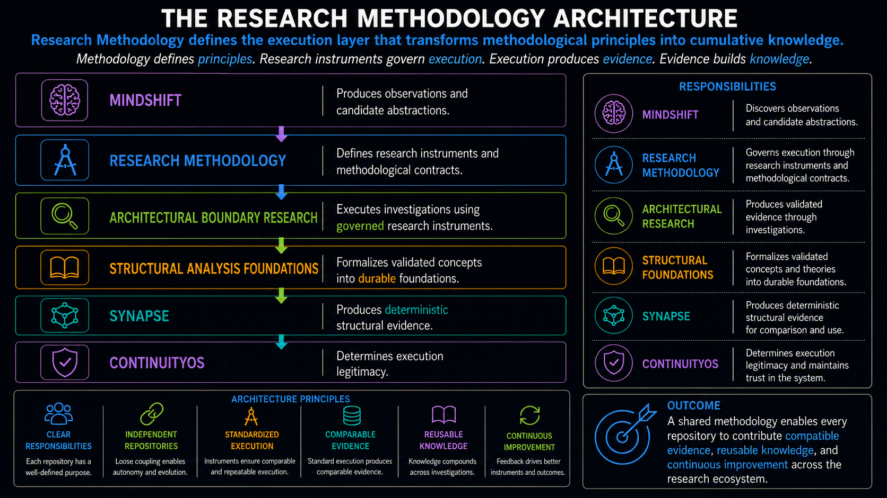

Research Methodology defines reusable methodology and instrument contracts. It does not execute investigations, formalize theory, produce deterministic structural evidence, or determine execution legitimacy.

### 9. The Research Methodology Principles

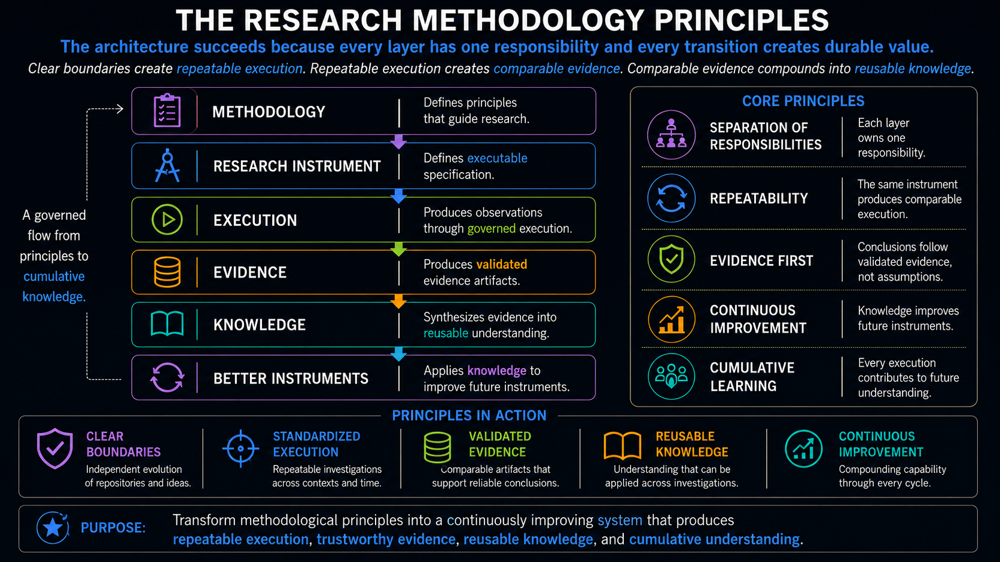

The architecture depends on clear ownership, repeatability, evidence-first reasoning, explicit boundaries, continuous calibration, and cumulative learning.

### 10. The Continuous Research System

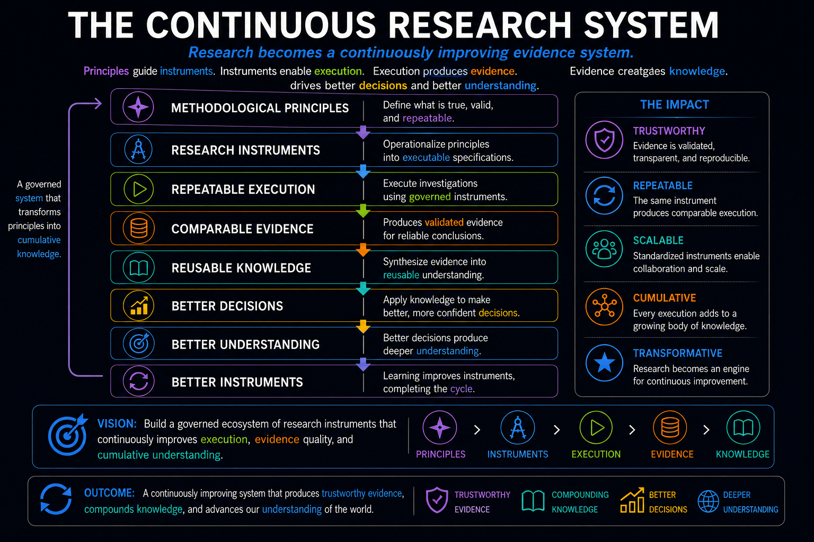

Research instruments connect principles, execution, evidence, knowledge, and improvement without collapsing their distinct meanings or authority boundaries.

### 11. The Research Shift

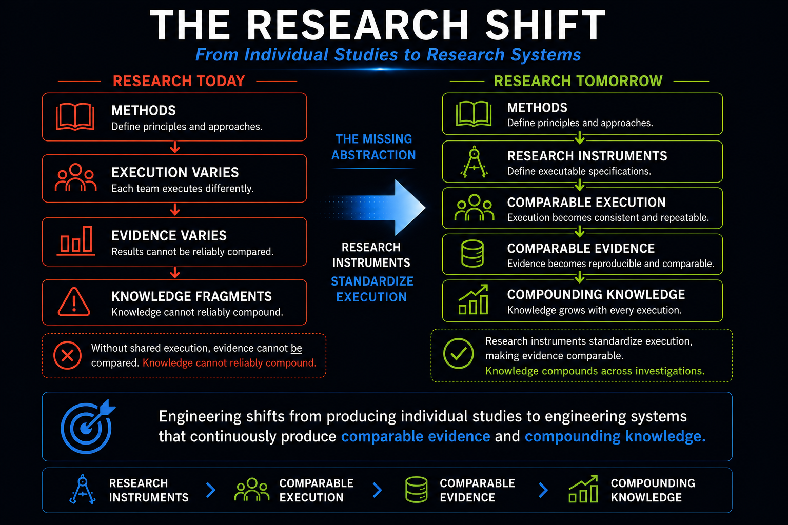

The long-term shift is from isolated studies with variable execution toward governed research systems that produce comparable evidence and support cumulative knowledge.

## Canonical Methodology-Engineering Contract

This repository now defines the **Minimum Methodology-Engineering Contract v0.1** as its first canonical documentation for methodology engineering. The canonical contract is maintained in [Methodology Engineering Canon](METHODOLOGY_ENGINEERING_CANON.md).

The contract explains how reusable research methodologies and scientific instruments are defined, versioned, reviewed, executed, calibrated, improved, and superseded without executing any particular study. It also establishes the required distinction ledger, minimum methodology object, methodology lifecycle, instrument lifecycle, repository boundary, known limitations, and explicit non-goals.

This repository also defines the **Cross-Domain Structology Transfer Audit v0.1** as a named methodology definition maintained in [Cross-Domain Structology Transfer Audit v0.1](CROSS_DOMAIN_STRUCTOLOGY_TRANSFER_AUDIT_V0_1.md). The audit definition specializes the generic contract for transfer assessment methodology only; it does not execute the audit or produce empirical findings.

Residual methodology-conformance outcomes, negative-capability and interaction boundaries, and non-mutating cross-registry reconciliation are defined in the [Residual Conformance, Negative Capability, and Reconciliation Contract v1.0](RESIDUAL_CONFORMANCE_NEGATIVE_CAPABILITY_AND_RECONCILIATION_CONTRACT_V1_0.md). That contract does not authorize execution, repair, synchronization, or scientific claims.

Residual generic evidence objects, lifecycle transitions, admissibility and sufficiency, projections, validated emission, and evidence-specific cross-repository conformance are defined in the [Residual Generic Evidence Lifecycle and Conformance Contract v1.0](RESIDUAL_GENERIC_EVIDENCE_LIFECYCLE_AND_CONFORMANCE_CONTRACT_V1_0.md). This repository owns only that reusable definition; concrete evidence and executions remain in their investigation or evidence repositories.

## Core Model

```text
Research Need
        ↓
Research Request
        ↓
Investigation Protocol
        ↓
Observations
        ↓
Evidence
        ↓
Analysis
        ↓
Decision
        ↓
Finding
        ↓
Publication
```

This sequence is not merely a workflow. Each step represents a typed object transformation governed by declared rules.

## Object, Methodology, and Execution

```text
Object
≠
Execution
```

An object represents a bounded research state or artifact.

Execution is an activity or event that creates, consumes, or transforms concrete object instances.

Research Methodology defines the transformation contract:

```text
Object
        ↓
Research Methodology
Defines valid transformations
        ↓
Research Execution
Applies a transformation
        ↓
New Object
```

Therefore:

```text
Methodology
≠
Research Execution
```

```text
Transformation Contract
≠
Transformation Event
```

## Research Transformation Contract

Every valid research transformation should define:

```text
Research Transformation {
  source object type
  admissible source state
  required inputs
  governing rule
  operation
  target object type
  resulting state
  preserved invariants
  permitted changes
  verification
  provenance
  uncertainty
  failure modes
  responsible roles
}
```

A transformation is valid only when its required inputs exist, its governing rule applies, its provenance resolves, its uncertainty is preserved, and its output satisfies the declared contract.

## First-Class Methodology Objects

Every first-class methodology object should have a consistent shape:

```text
Methodology Object {
  identity
  type
  purpose
  inputs
  outputs
  lifecycle
  relationships
  version
  provenance
  uncertainty
  verification
  failure state
}
```

Research-specific object types include:

- Research Request
- Investigation Protocol
- Observation Record
- Evidence Item
- Instrument
- Calibration Record
- Collection Run
- Transformation or Analysis Record
- Decision Record
- Finding
- Replication Attempt
- Verification Result
- Publication Record

These are type definitions. A specific investigation produces concrete instances.

## Current Scope

- Research-object definitions
- Investigation lifecycle and stage gates
- Evidence planning and admissibility
- Observation, derivation, measurement, and analysis boundaries
- Decision rules and adjudication
- Scientific instrument interfaces
- Calibration and improvement
- Replication and reproduction
- Verification and conformance
- Provenance, traceability, and lineage
- Missingness, uncertainty, and limitations
- Publication and transfer boundaries
- Failure, deviation, withdrawal, and supersession semantics

## Non-Scope

This repository does not contain:

- empirical study executions;
- investigation-specific evidence;
- Cross-Domain Structology Transfer Audit executions or any other domain-specific instrument execution;
- domain-specific research protocols;
- evidence models for specific studies;
- schemas, validators, runtime behavior, or methodology compilers;
- formal domain theory;
- deterministic analysis engines;
- operational execution systems;
- domain-specific research conclusions;
- authority to accept scientific claims;
- runtime object mutation;
- modifications to Structology.

Those artifacts remain in their respective repositories and executions.

## Relationship to Structology

Structology defines domain-neutral structural primitives.

Research Methodology specializes those primitives for research.

```text
Structology
Objects, stages, relations, transformations,
verification, provenance, and failure
        ↓
Research Methodology
Research-specific methodology and instrument contracts, including the Cross-Domain Structology Transfer Audit v0.1
        ↓
Architectural Boundary Research
Investigation-specific executions, evidence, assessments, and findings
```

Research Methodology must not redefine domain-neutral structure as though it were unique to research.

## Relationship to Research Execution

Research Methodology defines types and valid transformations.

Research execution creates instances and performs transformations.

For example:

```text
Research Methodology
Defines Observation Record
        ↓
Investigation
Creates BOR-001
```

```text
Research Methodology
Defines Evidence-to-Analysis transformation
        ↓
Investigation
Executes one analysis over frozen evidence
```

A completed object or transformation instance is evidence of execution. A methodology definition alone is not.

## Relationship to the Research Stack

```text
Structology
Defines domain-neutral structure
        ↓
Research Methodology
Defines research transformation contracts
        ↓
MindShift
Produces candidate abstractions and research requests
        ↓
Architectural Boundary Research
Executes empirical investigations
        ↓
Structural Analysis Foundations
Produces formal theory
        ↓
SYNAPSE
Produces deterministic structural evidence
```

ContinuityOS remains outside the scientific-method execution path. It governs execution legitimacy where mutation-capable actions require authorization.

Each repository owns a distinct transformation and produces a distinct class of artifact.

## Boundary Principles

```text
Methodology
≠
Research Execution
```

```text
Object Type
≠
Object Instance
```

```text
Analyst Activity
≠
Object Transformation
```

```text
Transformation
≠
Verification
```

```text
Verification
≠
Scientific Warrant
```

```text
Evidence
≠
Decision
```

```text
Publication
≠
Canonical Evidence
```

This repository defines how reproducible research may be structured. It does not conduct, formalize, implement, operationalize, or authorize the research itself.

## Current Status

This repository reserves the architectural boundary for a general research methodology while that methodology continues to emerge through active investigations.

Content should be promoted here only when it is reusable across multiple research domains and no longer belongs exclusively to `architecturalboundary-research` or another domain-specific repository.

## Historical Methodology Completeness Audit

`METHODOLOGY_COMPLETENESS_AUDIT.md` records an assessment performed on
2026-07-17 against repository baseline `f1a3b3e`.

The audit identifies the information, rules, transformations, and artifacts that
were missing or underspecified at that historical baseline. Its findings are
preserved as audit evidence and are not the current repository completeness
determination.

See [Methodology Completeness Audit](METHODOLOGY_COMPLETENESS_AUDIT.md).
